# **CRYPTOCURRENCIES TIME SERIES** :chart_with_upwards_trend:

This repository hosts a collection of notebooks featuring an in-depth analysis of ten cryptocurrencies, along with a comparative study of predictions made by various models specifically for BTC. The following models were meticulously evaluated:

- ARIMA
- XGBoost
- LSTM GRU
- Prophet

## Cryptocurrencies Comparison

In the first stage, a comparison of 10 cryptocurrencies was carried out. For that, data from `yfinance` from January 2019 to June 2023 were downloaded and the following features were extracted:

- **Date**: Trade date
- **Open**: Opening stock price
- **High**: Peak price during the trading day
- **Low**: Lowest price during the trading day
- **Close**: Closing stock price
- **Adj Close**: Adjusted closing price, accounting for splits, offerings, and dividends for accurate historical comparison
- **Volume**: Total trade volume for the day

The utilization of Adj Close allows for meaningful comparisons between cryptocurrencies, and these values are thoughtfully visualized through multiple subplots.

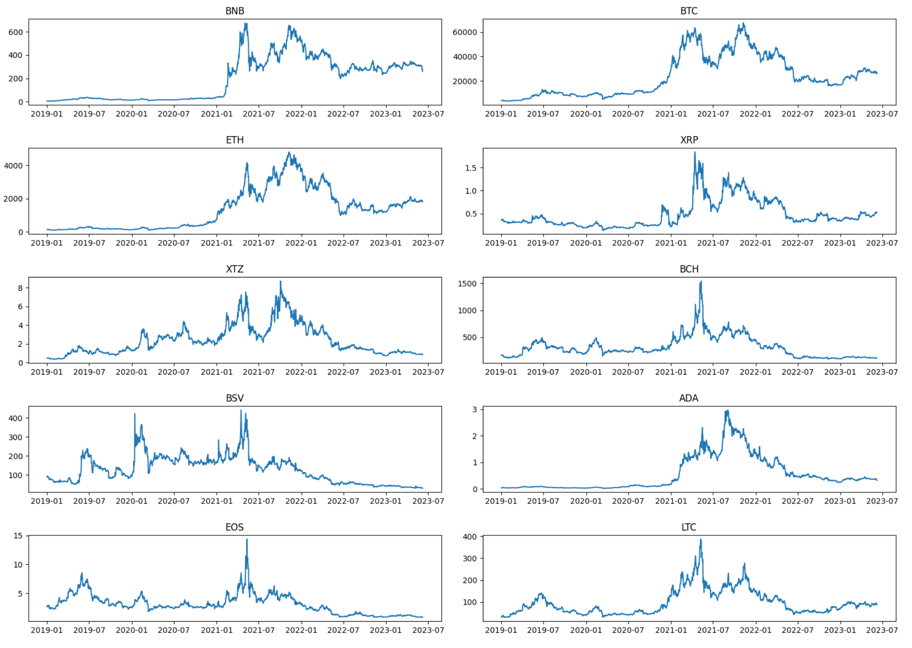 

In the pursuit of enhanced insights, **returns** were computed, providing a measure of profitability over a specific period. Furthermore, cumulative returns were calculated to express the overall price change of a cryptocurrency over time.

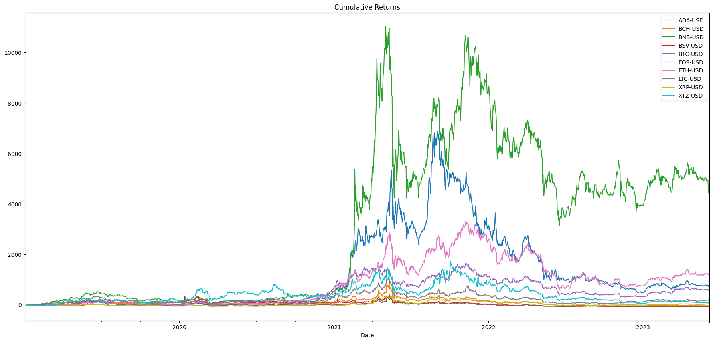 

Notably, a pattern emerges revealing varying **degrees of correlation** between different cryptocurrencies. BCH, ETH, EOS, and LTC exhibit a strong positive correlation, implying that when one of these cryptocurrencies experiences an increase, the others tend to follow suit. Conversely, BSV displays a weaker correlation with BNB and XRP.

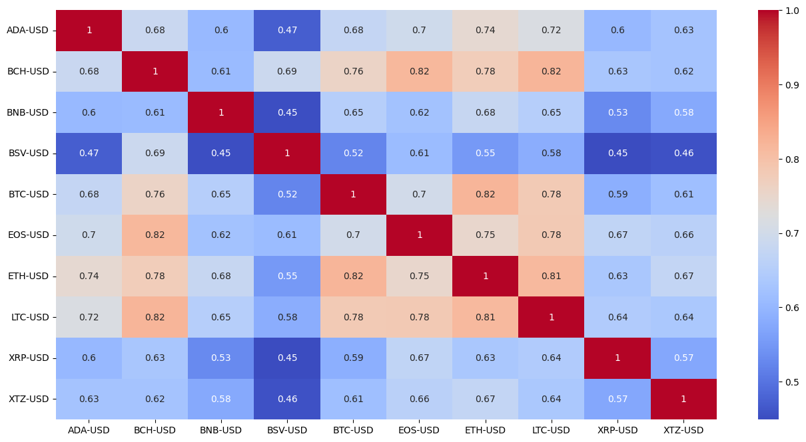 

The application of a **moving average**, also known as a rolling average, helped in smoothing out short-term price fluctuations to identify longer-term trends or cycles. For instance, a 7-day moving average captures short-term trends, while a 100-day rolling average highlights more substantial trends. The use of arithmetic mean was adopted in this context.

From the plotted chart, it is discernible that in May of 2021, the price dipped below the 50-day moving average, signifying a **downward trend**. Conversely, in August 2021, the price surged above the moving average, indicating an **upward trend**.

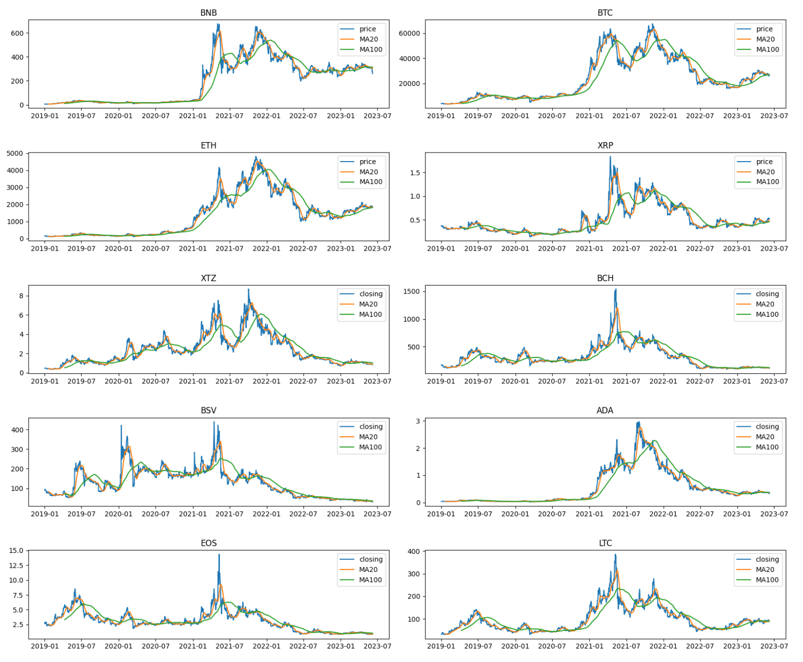 

Further observations reveal that around May of 2021, the 20-day moving average crossed below the 100-day moving average, signaling a shift towards a downward trend and serving as a **sell signal**. Conversely, by August 2021, the 20-day moving average crossed above the 100-day moving average, marking an upward trend and presenting a **buy signal**.

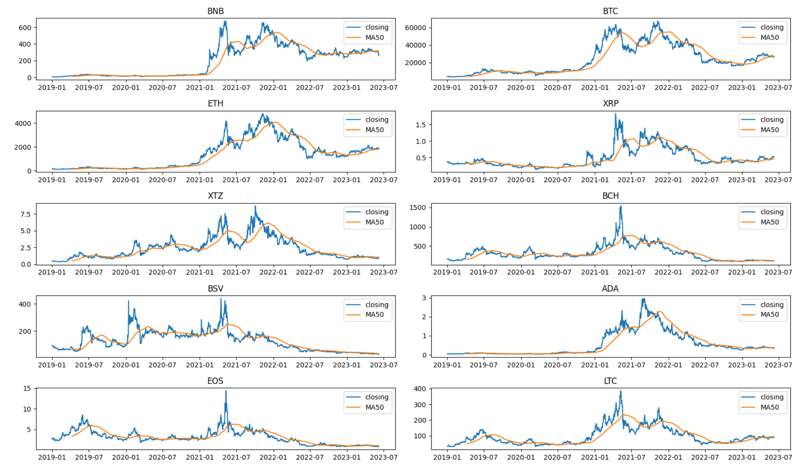 

## BTC Analysis

The subsequent phase of analysis delved into an in-depth exploratory data analysis (EDA) of BTC, aiming to uncover valuable insights. This analysis period encompassed data obtained from Binance, spanning from January 2020 to May 2023, as Binance provides a more comprehensive dataset. The dataset from Binance included various data attributes such as:

- **open_time**: Opening time of the specified period
- **open**: Opening price of the trading instrument for the given period
- **high**: Highest price attained by the trading instrument during the specified period
- **low**: Lowest price reached by the trading instrument during the specified period
- **close**: Closing price of the trading instrument for the given period
- **volume**: Total trading volume, representing the quantity of the trading instrument, during the specified period
- **close_time**: Closing time of the specific period
- **quote_volume**: Total volume in terms of the quote asset, which determines the trading instrument's value
- **count**: Number of trades occurring during the specified period
- **taker_buy_volume**: Volume of the quote asset bought by market takers during the period
- **taker_buy_quote_volume**: Volume of the base asset bought by market takers during the period

To ensure a comprehensive and accurate dataset, the following actions were taken:

- Identification and handling of missing data points and their corresponding values
- Utilization of interpolation to fill in the gaps with the mean values

Upon obtaining the complete dataset (saved under `BTCUSDT_final_clean.csv`), the primary focus shifted towards the analysis of the closing prices. It was noted that in both 2020 and 2022, the cryptocurrency market experienced two significant **crashes** attributed to the impact of the COVID pandemic and the collapse of FTX exchange.

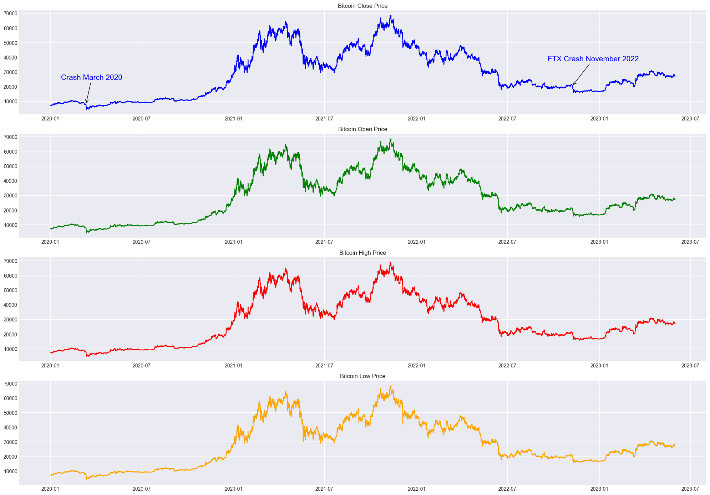

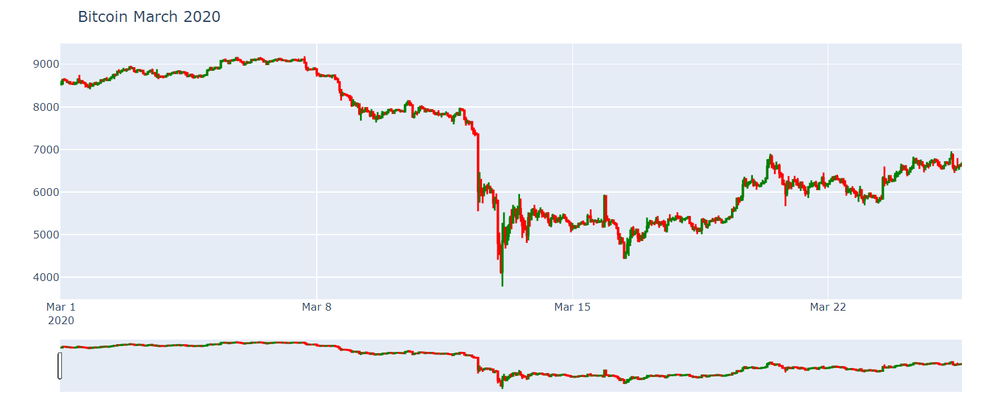

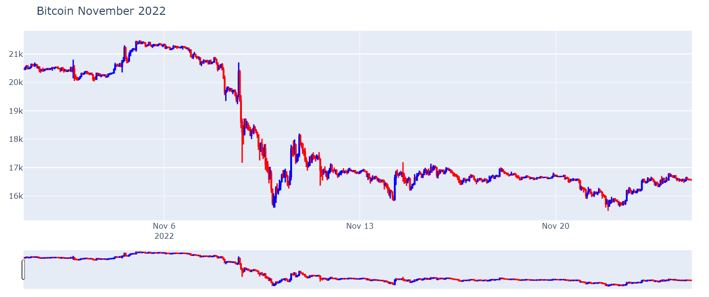

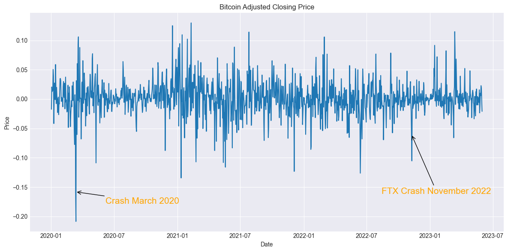

Another insightful indicator employed was the **lag plot**. The visuals illustrated that lags of 1 and 2 days exhibited minimal noise, suggesting the potential for time series resampling. Subsequently, a 1-day resampling interval was chosen for further exploration.

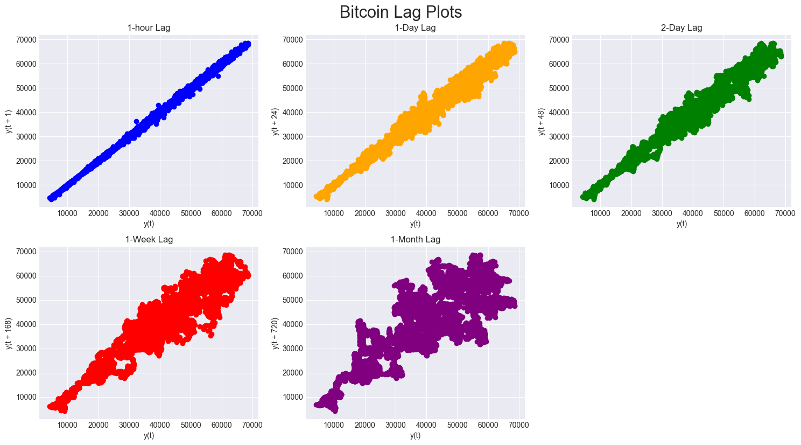

Among the models examined later in the analysis, **ARIMA** was a key focus. This model necessitated several steps including time series **decomposition**, **autocorrelation** assessment (ACF and PACF), and **stationarity** checks (KPSS and ADF). The findings revealed the absence of seasonality in the series, with both p and q values being 1 each, and a differencing level of 1 was employed to attain stationarity. Intriguingly, the p, q, and d values determined by the auto_arima method were (1,1,0).

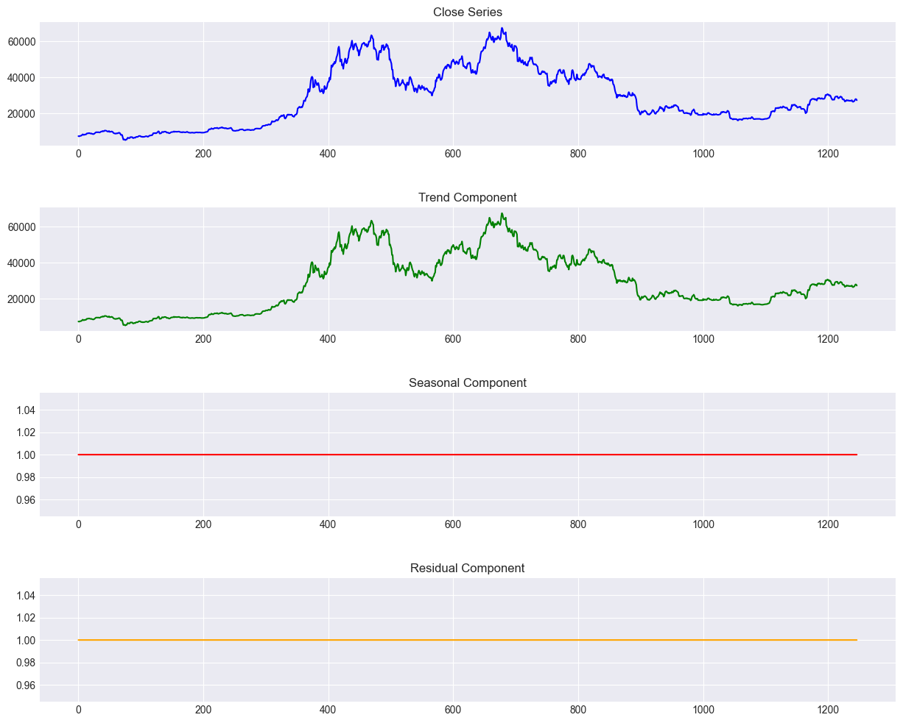

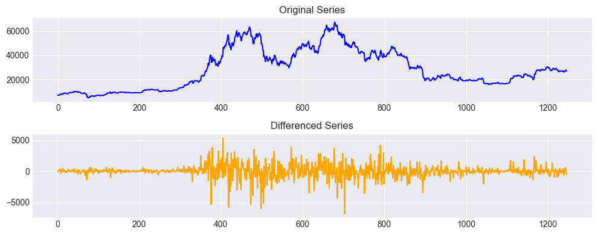

After this EDA the modeling phase started wuth the clean dataset.

## Modeling

The following models were meticulously evaluated:

- ARIMA
- XGBoost
- LSTM GRU
- Prophet

In general all models achieve very good results and the actual vs. predicted price curve is similar for all models (see below the one of LSTM GRU)

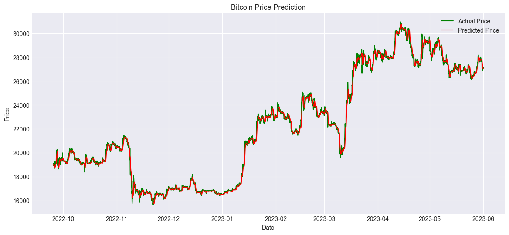

| Left |  Center  | Right |
|:-----|:--------:|------:|
| L0   | **bold** | $1600 |
| L1   |  `code`  |   $12 |
| L2   | _italic_ |    $1 |